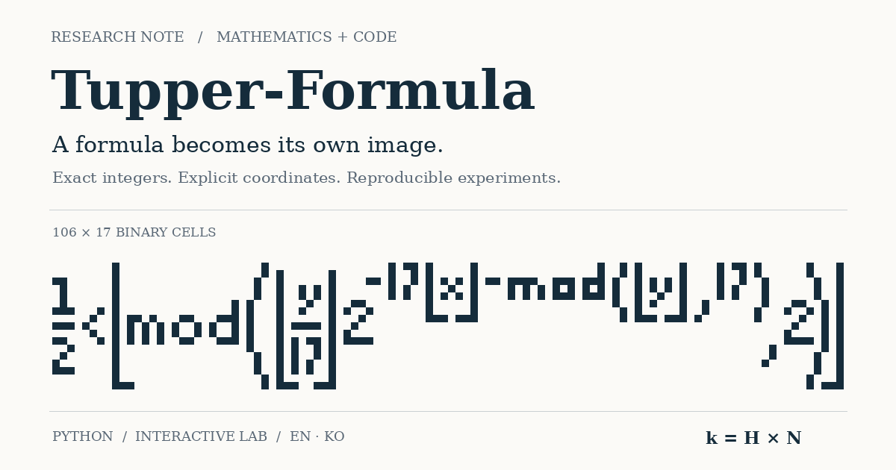

[English](README.md) · [한국어](README-KR.md)

# Tupper-Formula

**Exact bitmap encodings, constructive self-images, and reproducible mathematical experiments.**



A research-oriented repository with an English/Korean, light-only academic website and a separate Python package. It explains why a finite image appears in Tupper's inequality, constructs the corresponding integer offset, and checks the result using integer arithmetic and a rational-arithmetic evaluation of the original nested floor/mod expression.

> **Scope:** `derive` constructs a **Tupper-type self-image with an external offset `k`**. It does not claim a new mathematical discovery or implement a self-contained equation that also prints its own enormous constant. Those stronger constructions are discussed separately and attributed to their authors.

## What is included

| Component | Purpose |
|---|---|
| Academic website | Derivation, literature context, references, one-click LaTeX copying, responsive English/Korean layout; no dark theme or external CDN |
| Browser laboratory | Paint pixels, inspect bit positions, decode decimal `k`, change orientation, import/export verified JSON, SVG and PBM |
| Python research package | Exact encoding/decoding, original-expression oracle, formula-to-bitmap construction, image import, CLI, base-C array experiments |
| Reproducible evidence | Five checked example bundles, exhaustive small-mask experiments, randomized tests, cross-language fixtures and machine-readable reports |
| Publication assets | 1200×630 OG PNG and vector source, BibTeX, citation metadata, bilingual documentation, CI and optional Pages workflow |

The original figure is **recomputed from the integer printed in Tupper's 2001 paper**, not copied as a screenshot. The renderer, encoding and website in this repository are original implementations. See [literature and attribution](docs/LITERATURE.md).

## Start the website

From the repository root:

```sh
python -m http.server 8000
```

Open **http://localhost:8000/**. English is the initial language; the header switches to Korean, or use `?lang=ko`. Do not double-click `index.html`: the interactive application uses ES modules and local JSON fetches, which require HTTP. The initial English article and MathML equations are also present in static HTML.

No Node installation or build step is needed to view the checked-in site. Mathematics uses native MathML; fonts come from the operating system. Pixel data stays in the browser. Clipboard and SHA-256 features work best on HTTPS or localhost; copying has a manual fallback.

## Start the Python research program

Requires **Python 3.11+**. The exact core has no third-party runtime dependencies.

```sh
python -m venv .venv
# Linux/macOS: source .venv/bin/activate
# Windows PowerShell: .venv\Scripts\Activate.ps1
python -m pip install -e .

python -m tupper_formula encode examples/input/letter-a.txt -o output/a
python -m tupper_formula verify output/a/experiment.json --literal
python -m tupper_formula cell output/a/experiment.json --x 1 --j 4
```

`N = 16015`, `k = 80075` for the supplied 3×5 letter A. Output directories must be new; the CLI refuses to overwrite an existing experiment.

### Construct an inequality's own image

This command typesets a selected inequality, thresholds the resulting image, packs its pixels into `N`, computes `k = HN`, and verifies the recovered mask. It is not a website generator.

```sh
python -m pip install -e ".[render]"
python -m tupper_formula derive --height 32 --variant tupper -o output/self-h32
python -m tupper_formula verify output/self-h32/experiment.json --literal

# An algebraically equivalent predicate, with different typography and k:
python -m tupper_formula derive --height 32 --variant bit -o output/bit-h32
```

The bundled `formula-h32` experiment uses a 353×32 mask; its `k` has 3,380 decimal digits. The exact binary mask is authoritative: a different renderer, font version or threshold may produce a different mask and integer. `requirements-render.txt` records the versions used for the bundled renderings. No TeX installation or font download is needed; no font files are distributed here.

Each experiment contains `experiment.json`, `verification.json`, `N.txt`, `k.txt`, `formula.tex`, `target.pbm`, `decoded.pbm` and `plot.svg`. Formula construction also adds `plot.png`.

## Mathematical contract

For a W×H binary image with mathematical coordinates `i` increasing rightward and `j` upward:

$$
N=\sum_{i=0}^{W-1}\sum_{j=0}^{H-1} b_{i,j}2^{Hi+j},\qquad k=HN.
$$

The integer at `N` contains the pixels. The inequality reads one bit per unit square in `0 ≤ x < W`, `k ≤ y < k+H`. Files store rows **top-to-bottom**; the conversion is explicit. A `historical` display reverses both visible axes, without silently changing the stored data. Width is metadata and cannot generally be recovered from `N` alone.

See [the proof](docs/THEORY.md) for half-open cell boundaries, the floor/mod identity, repeated occurrences and information-size limits.

## Tests and recorded evidence

```sh
python -m unittest discover -s tests -v
python experiments/run_suite.py
npm test
python scripts/validate_repo.py
```

`npm test` needs Node 20+ but installs no packages. The committed arithmetic report records **658 exhaustive masks**, **300 seeded random masks**, **5,442 exact rational midpoint checks**, and **zero mismatches**. The midpoint count belongs to the exhaustive suite, not every test in the repository. The separate Python and JavaScript unit suites and browser checks are recorded in [validation.json](reports/validation.json); see [reproduction](docs/EXPERIMENTS.md) for their scopes.

A test result is not a proof of all possible inputs. The algebra establishes the general bit identity; the finite experiments check the implementations. Recorded checks are not evidence that GitHub deployment, all browser engines or all operating systems were tested.

## Repository map

```text
Tupper-Formula/
├── index.html                 # Ready-to-serve English article
├── css/                       # Paper layout and print stylesheet
├── js/                        # Independent BigInt core, MathML and UI
├── data/                      # EN/KO text, formulas, presets and references
├── assets/                    # Recomputed figure, OG PNG/SVG, favicon
├── src/tupper_formula/        # Python research package, not web code
├── examples/                  # Canonical experiment bundles
├── experiments/               # Exhaustive/seeded reproducibility runner
├── tests/                     # Python and native Node tests
├── schemas/                   # Interchange JSON schema
├── scripts/                   # Site/assets build, QA and deployment helpers
├── docs/                      # English documents and matching -KR.md files
├── reports/                   # Actual machine-readable verification results
└── .github/workflows/         # CI and optional GitHub Pages deployment
```

## Documentation

[Theory](docs/THEORY.md) · [Literature](docs/LITERATURE.md) · [Python API and CLI](docs/PYTHON-GUIDE.md) · [Experiments](docs/EXPERIMENTS.md) · [Website and deployment](docs/WEBSITE.md) · [Research directions](docs/RESEARCH.md) · [Limitations](docs/LIMITATIONS.md)

All Markdown documents have Korean counterparts. The English documents define the canonical technical contract; translation changes must keep it identical.

## Publish on GitHub Pages

The configured target is `https://jtech-co.github.io/Tupper-Formula/`; this is a configuration, **not a claim that a public deployment already exists**. Change it before publishing under another account or repository:

```sh
python scripts/configure_site.py --owner YOUR_ACCOUNT --repo Tupper-Formula
```

Then either publish `main / (root)` in the repository's Pages settings, or choose **GitHub Actions** and run the included `pages.yml` workflow. Use only one publishing source. [Deployment details](docs/WEBSITE.md) include subpath handling and OG metadata. This ZIP does not push a repository or create a hosted site.

## Attribution and license

Original project code, prose and generated assets are offered under [MIT](LICENSE). Referenced articles, their authors' implementations and their respective rights remain separate. Bundled examples derived from the historical mathematical constant are explicitly attributed. No paper PDFs or third-party source code are vendored.

Use [CITATION.cff](CITATION.cff) for this software and [references.bib](references.bib) for the scientific sources. Please preserve the distinction between reproduction, constructive examples and new theorems when citing results.
